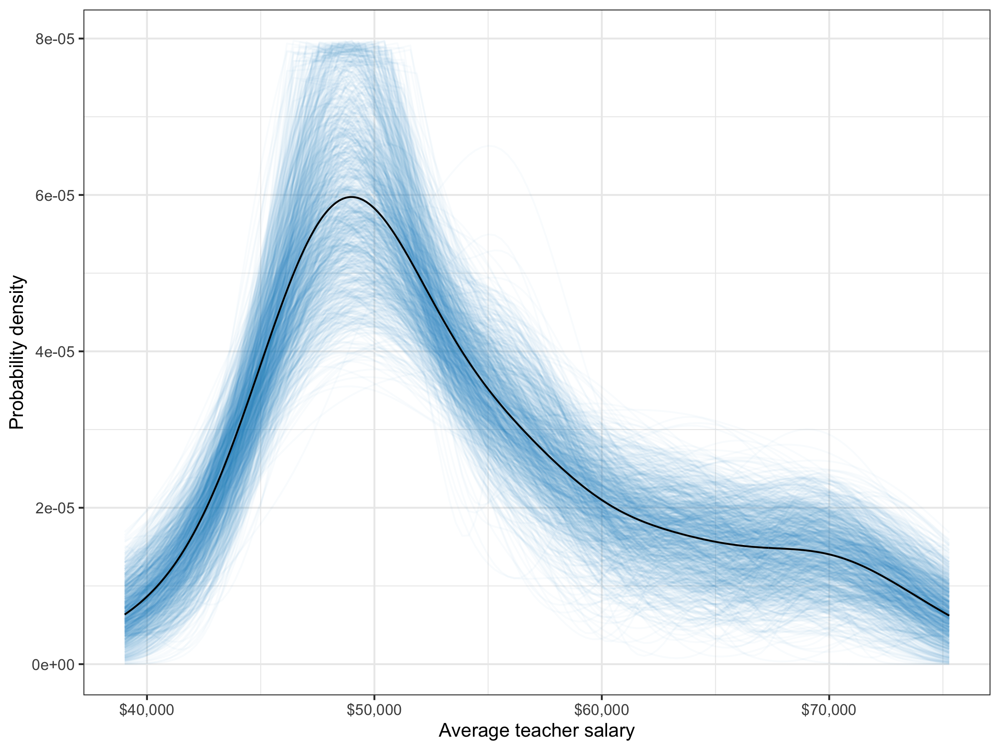

```{r setup, include=FALSE}
knitr::opts_chunk$set(echo = TRUE)
```

The **educate** package has several functions to generate confidence envelopes for kernel density smoothers from bootstrapped samples:

- `stat_watercolor_density()`
- `watercolor_density()`

The `stat_watercolor_density()` function can be used as a layer directly in ggplot, while the `watercolor_density()` function is a stand-alone function that creates a ggplot object (no ggplot syntax required). Below I illustrate the usage and functionality of each of these functions.

### stat_watercolor_density()

```{r eval=FALSE}
# Load libraries
library(ggplot2)
library(scales)
library(educate)

ggplot(data = education, aes(x = salary)) +
  stat_watercolor_density() +
  stat_density(aes(y = ..density..), geom = "line", size = 0.5) +
  theme_bw() +
  scale_x_continuous(name = "Average teacher salary", labels = dollar) +
  ylab("Probability density")
```

```{r echo=FALSE, out.width='60%', fig.align='center'}

```


The figure shows the kernel density plot of the observed teacher salaries (black) along with the density plots for 1,000 bootstrapped samples (blue).

Aside from changing the color and transparency of the bootstrapped densities (`color=` and `alpha=` respectively), you can also change the number of bootstrapped samples (`k=`). 

#### Bootstrapping from a Parametric Model

By default, `model="none"`, the bootstrapping is performed on the observed data. Changing the model argument to `model="normal"` will take random draws from a normal model with mean and standard deviation estimated using ML from the data. For example,

```{r eval=FALSE}
ggplot(data = education, aes(x = salary)) +
  stat_watercolor_density(model = "normal") +
  stat_density(aes(y = ..density..), geom = "line", size = 0.5) +
  theme_bw() +
  scale_x_continuous(name = "Average teacher salary", labels = dollar) +
  ylab("Probability density")
```

```{r echo=FALSE, out.width='60%', fig.align='center'}
knitr::include_graphics("figs/wc-density-example-02.png")
```

For now, the only model one can bootstrap from is the normal model.


### watercolor_density

Essentially the same set of plots can be obtained using the `watercolor_density()` function which is not embedded as a ggplot layer. To create the previous plots we use the following syntax, respectively

```{r eval=FALSE}
watercolor_density(data = education, x = salary)
watercolor_density(data = education, x = salary, model = "normal")
```

This function also supports multicolor for indicating probability in the confidence enevelope via color and transparency.

```{r eval=FALSE}
watercolor_density(data = education, x = salary, multicolor = TRUE)
```

```{r echo=FALSE, out.width='60%', fig.align='center'}
knitr::include_graphics("figs/wc-density-example-03.png")
```


Lastly, since this function outputs a ggplot object, you can add ggplot layers to customize the plot.


```{r eval=FALSE}
watercolor_density(data = education, x = salary, multicolor = TRUE) +
  scale_x_continuous(name = "Average teacher salary", labels = dollar) +
  ylab("Probability density")
```


```{r echo=FALSE, out.width='60%', fig.align='center'}
knitr::include_graphics("figs/wc-density-example-04.png")
```
