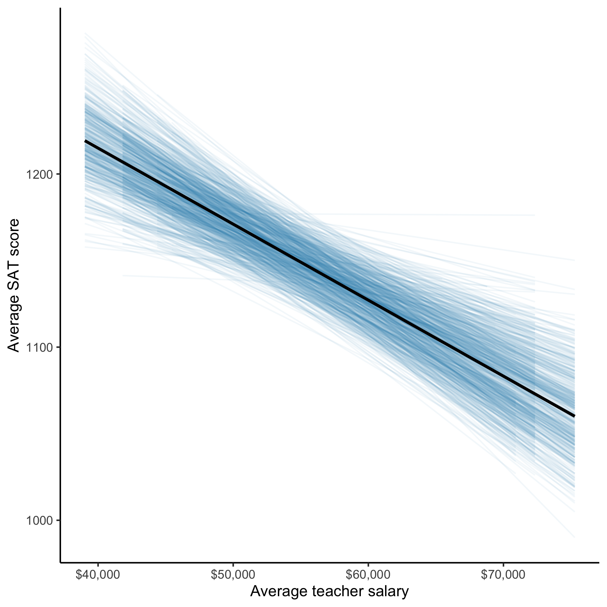
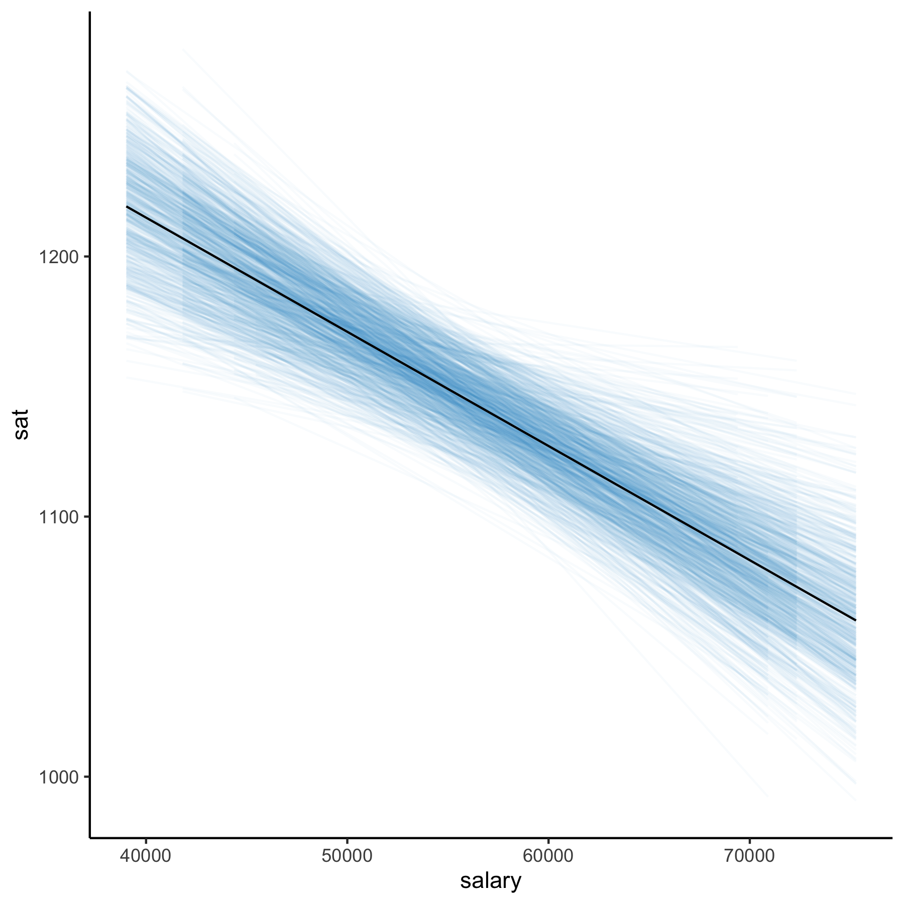

```{r setup, include=FALSE}
knitr::opts_chunk$set(echo = TRUE)
```

The **educate** package has several functions to generate smoothers from bootstrapped samples:

- `stat_watercolor_smooth()`
- `watercolor_smoother()`, 
- `watercolor_smoother_felix()`

The `stat_watercolor_smooth()` function can be used as a layer directly in ggplot, while the other two functions are stand-alone functions that create ggplot objects (no ggplot syntax required). Below I illustrate the usage and functionality of each of these functions.

### stat_watercolor_smooth()

```{r message = FALSE, warning = FALSE, eval=FALSE}
# Load libraries
library(ggplot2)
library(scales)
library(educate)

ggplot(data = education, aes(x = salary, y = sat)) +
  stat_watercolor_smooth(method = "lm") +
  geom_smooth(method = "lm", se = FALSE, color = "black") +
  theme_classic() +
  scale_x_continuous(name = "Average teacher salary", labels = dollar) +
  ylab("Average SAT score")
```

```{r echo=FALSE, out.width='60%', fig.align='center'}

```

The figure shows average SAT score plotted as a function of average teacher salaries. The OLS regression line (black) and regression lines for 700 bootstrapped samples (blue) are also displayed. If no method is specified, or `method="loess` is used, the functions will fit a loess smoother. That is demonstrated below along with showing how to change the `k=` and `alpha=` arguments. (Note if the sample size is large and no method is specified a GAM model will be fitted.)

```{r eval=FALSE}
ggplot(data = education, aes(x = salary, y = sat)) +
  stat_watercolor_smooth(k = 1000, alpha = 0.03) +
  geom_smooth(se = FALSE, color = "black") +
  theme_classic() +
  scale_x_continuous(name = "Average teacher salary", labels = dollar) +
  ylab("Average SAT score")
```

```{r echo=FALSE, out.width='60%', fig.align='center'}
knitr::include_graphics("figs/wc-smoother-example-02.png")
```


### watercolor_smoother

Essentially the same plot can be obtained using the `watercolor_smoother()` function which is not embedded as a ggplot layer. The difference is the default number of bootstrap samples is `k=1,000` (rather than `k=700`) and the default alpha level is `alpha=0.03` (rather than `alpha=0.06`).

```{r eval=FALSE}
watercolor_smoother(data = education, x = salary, y = sat, method = "lm")
```

```{r echo=FALSE, out.width='60%', fig.align='center'}

```


```
